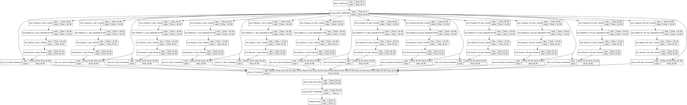
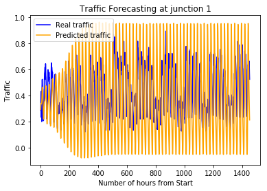
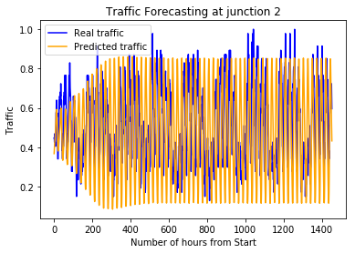
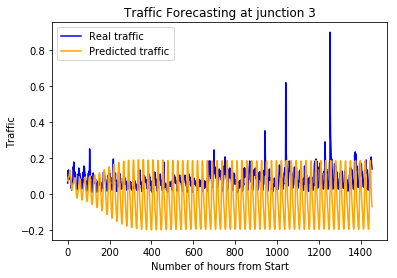
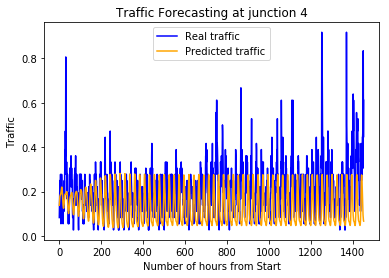

# McKinsey-SmartCities-Traffic-Prediction
Adventure into using NN for time-series for the 20171118 McKinsey IronMan (24h non-stop) prediction challenge


This was a code I created without sleeping for the following challenge: https://datahack.analyticsvidhya.com/contest/mckinsey-analytics-hackathon/


# Problem statement

**Mission:** You are working with the government to transform your city into a smart city.
The vision is to convert it into a digital and intelligent city to improve the efficiency of services for the citizens.
One of the problems faced by the government is traffic.
You are a data scientist working to manage the traffic of the city better and to provide input on infrastructure planning for the future.

The government wants to implement a robust traffic system for the city by being prepared for traffic peaks.
They want to understand the traffic patterns of the four junctions of the city.
Traffic patterns on holidays, as well as on various other occasions during the year, differ from normal working days.
This is important to take into account for your forecasting.

**Your task:** To predict traffic patterns in each of these four junctions for the next 4 months.

**Data:** The sensors on each of these junctions were collecting data at different times,
hence you will see traffic data from different time periods.
To add to the complexity, some of the junctions have provided limited or sparse data requiring thoughtfulness
when creating future projections. Depending upon the historical data of 20 months,
the government is looking to you to deliver accurate traffic projections for the coming four months.
Your algorithm will become the foundation of a larger transformation to make your city smart and intelligent.

The evaluation metric for the competition is RMSE. Public-Private split for the competition is 25:75.

# Exploratory Data Analysis (EDA)

See [here](EDA.ipynb)

We have 48120 point of training data (data **each hour** from 2015-11-01 to 2017-06-30 for 4 junctions)
And 11808 points to predict

# Approach

Instead of using time-series classics ARMA (auto-regressive moving average) and ARIMA (autoregressive integrated moving average) models
or the Kaggle competition classic XGBoost, I choose to try my hand at neural networks.

Given the time constraint, I had to use Keras for quicker prototyping and more documentations
even though my preferred framework is PyTorch.

The direct consequence is unoptimized seq2seq as I couldn't share weights between RNNs in Keras at the time (Nov2017).

# Architecture

I used a multi-attention Recurrent Neural Network defined as below to capture lag features.
```Python

def Net(num_feats, seq_len, num_hidden, num_outputs):
    x = Input(shape=(seq_len, num_feats))

    # Encoder RNNs
    enc = CuDNNGRU(seq_len,
                   return_sequences=True,
                   stateful = False,
                   name = 'Encoder_RNN')(x)

    # Attention decoders (lag features)
    attention_0d = attention_n_days_ago(enc, 0)
    attention_1d = attention_n_days_ago(enc, 1)
    attention_2d = attention_n_days_ago(enc, 2)
    attention_4d = attention_n_days_ago(enc, 4)
    attention_1w = attention_n_days_ago(enc, 7)
    attention_2w = attention_n_days_ago(enc, 14)
    attention_1m = attention_n_days_ago(enc, 30)
    attention_2m = attention_n_days_ago(enc, 60)
    attention_1q = attention_n_days_ago(enc, 92)
    attention_6m = attention_n_days_ago(enc, 184)
    attention_3q = attention_n_days_ago(enc, 276)
    attention_1y = attention_n_days_ago(enc, 365)

    att = Concatenate(name='attns_cat', axis = 1)([attention_0d,
                                                   attention_1d,
                                                   attention_2d,
                                                   attention_4d,
                                                   attention_1w,
                                                   attention_2w,
                                                   attention_1m,
                                                   attention_2m,
                                                   attention_1q,
                                                   attention_6m,
                                                   attention_3q,
                                                   attention_1y])

    # How to merge? concat, mul, add, use Dense Layer or convolution ?

    att = Dense(seq_len, activation=None, name='Dense_merge_attns')(att)
    # att = Lambda(lambda x: softmax(x, axis = 1),
    #              name='Dense_merge_3D_softmax')(att) # Flatten along the concat axis

    # Decoder RNN
    dec = CuDNNGRU(num_hidden,
                   return_sequences=False,
                   stateful = False,
                   name='Decoder_RNN')(att)

    # Regressor
    # Note that Dense is automatically TimeDistributed in Keras 2
    out = Dense(num_outputs, activation=None,
                name = 'Classifier')(dec) # no activation for regression

    model = Model(inputs=x, outputs=out)

    model.compile(loss= root_mean_squared_error, optimizer = optim)
    return model
```


Important note: make sure to use CUDNNGru and CUDNNLSTM because the default GRU and LSTM are
implemented by Google in Tensorflow while the CuDNN were by Nvidia. Google version is **slow**

# Result

Teacher forcing by predicting 48 hours (bassed on real histical values):


Predicting the whole 3 months based on previous predictions:





Note: the optimizer chosen has a big influence on the last part,
using `RMSprop` instead of `Adam` would give me some response during the first week and then 0 traffic the whole time left.

I then ran out of time to debug the issue of my model predicting a sinusoid.

# Future work

I probably should reimplement that in a dynamic framework like PyTorch to share the state between the RNN.
Furthermore ARMA/ARIMA capture the general trend but as shown by the 48 hours prediction, my model can capture fast change quite well.
So stacking both + an xgboost model should improve the results a lot.
